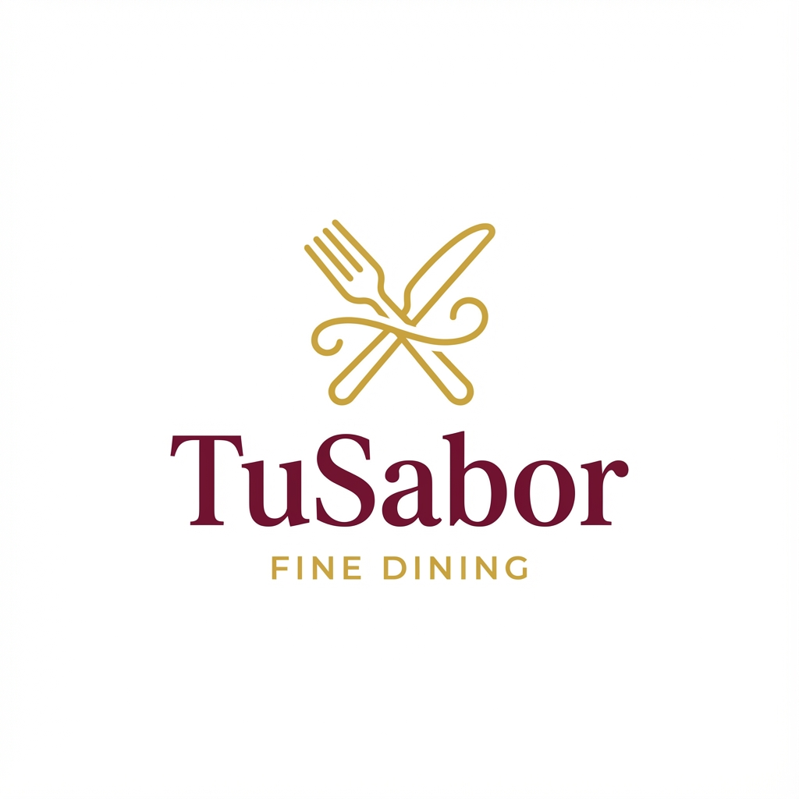

# TuSabor - Sistema de Gestión Gastronómica

  <!-- Reemplazar con el enlace al logo subido a GitHub -->

**TuSabor** es un sistema de gestión integral para restaurantes, desarrollado en Laravel 10. La plataforma unifica dos modelos de negocio críticos (reservas de mesas y pedidos a domicilio) y potencia la atención al cliente con un chatbot basado en Inteligencia Artificial.

---

##  Características Principales

-   **Doble Modelo de Negocio:** Gestión simultánea de reservas presenciales y e-commerce para delivery.
-   **Arquitectura MVC:** Código organizado, escalable y mantenible siguiendo las mejores prácticas de Laravel.
-   **Panel de Administración Completo:** Dashboard con métricas en tiempo real y CRUDs para productos, categorías, mesas, pedidos y reservas.
-   **Autenticación Dual:** Perfiles de **Cliente** y **Administrador** con permisos y vistas diferenciadas.
-   **Base de Datos Optimizada:** MySQL con 5+ procedimientos almacenados para consultas críticas.
-   **Asistente Virtual con IA:** Chatbot 24/7 para resolver dudas, recomendar productos y asistir en la navegación.
-   **Experiencia de Usuario Premium:** Interfaz responsive, intuitiva y con una identidad visual de alta gama.

---

##  Guía de Instalación Rápida

### Prerrequisitos

-   PHP >= 8.1
-   Composer
-   Node.js & NPM
-   Servidor de base de datos (MySQL 8.0 recomendado)

### Pasos de Instalación

1.  **Clonar el repositorio:**
    ```bash
    git clone https://github.com/tu-usuario/tusabor.git
    cd tusabor
    ```

2.  **Instalar dependencias de PHP:**
    ```bash
    composer install
    ```

3.  **Instalar dependencias de Node.js:**
    ```bash
    npm install && npm run build
    ```

4.  **Configurar el entorno:**
    -   Copia el archivo `.env.example` a `.env`:
        ```bash
        cp .env.example .env
        ```
    -   Genera la clave de la aplicación:
        ```bash
        php artisan key:generate
        ```

5.  **Configurar la Base de Datos:**
    -   Abre el archivo `.env` y configura las credenciales de tu base de datos:
        ```env
        DB_CONNECTION=mysql
        DB_HOST=127.0.0.1
        DB_PORT=3306
        DB_DATABASE=tusabor
        DB_USERNAME=root
        DB_PASSWORD=
        ```
    -   Crea la base de datos `tusabor` en tu gestor de MySQL.

6.  **Ejecutar Migraciones y Seeders:**
    -   Esto creará las tablas y poblará la base de datos con datos de ejemplo (usuarios, categorías, productos, mesas).
        ```bash
        php artisan migrate --seed
        ```

7.  **Importar Procedimientos Almacenados:**
    -   Importa los archivos SQL ubicados en `database/stored_procedures/` en tu base de datos. (Ej: `sp_verificar_disponibilidad_mesa.sql`)

8.  **Crear el enlace simbólico para el almacenamiento:**
    ```bash
    php artisan storage:link
    ```

9.  **Iniciar el servidor de desarrollo:**
    ```bash
    php artisan serve
    ```

10. **Acceder a la aplicación:**
    -   Abre tu navegador y visita: `http://127.0.0.1:8000`

### Credenciales de Acceso (Seeders)

-   **Administrador:**
    -   **Email:** `admin@tusabor.com`
    -   **Contraseña:** `password`
-   **Cliente:**
    -   **Email:** `cliente@tusabor.com`
    -   **Contraseña:** `password`

---

##  Stack Tecnológico

-   **Backend:** Laravel 10 (PHP 8.1)
-   **Frontend:** Blade Templates, Bootstrap 5, JavaScript, jQuery, AJAX
-   **Base de Datos:** MySQL 8.0
-   **Inteligencia Artificial:** [Especificar API usada: OpenAI, Gemini, etc.]
-   **Servidor:** Apache/Nginx (compatible con Laravel)

---

## 📂 Estructura del Proyecto

El proyecto sigue la estructura estándar de Laravel, con las siguientes personalizaciones clave:

```
/app
|-- Http
|   |-- Controllers
|       |-- Admin/      # Controladores para el panel de admin
|       |-- Cliente/    # Controladores para el perfil de cliente
|       |-- Auth/       # Controladores de autenticación
|-- Models/         # Modelos Eloquent (Producto, Reserva, Pedido, etc.)
|-- Providers/

/database
|-- migrations/     # Migraciones de la base de datos
|-- seeders/        # Seeders para poblar la BD con datos de prueba
|-- stored_procedures/ # Scripts SQL de los procedimientos almacenados

/resources
|-- views
|   |-- admin/        # Vistas del panel de admin
|   |-- cliente/      # Vistas del perfil de cliente
|   |-- auth/
|   |-- layouts/
|-- css/
|-- js/

/routes
|-- web.php         # Rutas agrupadas por middleware (auth, admin)

```

---

##  Funcionalidades Clave

### Perfil del Cliente

-   [x] **Autenticación:** Registro y Login.
-   [x] **Catálogo de Productos:** Con filtros y modal de detalles.
-   [x] **Carrito de Compras:** Dinámico y persistente en la sesión.
-   [x] **Sistema de Reservas:** Con selector visual de mesas y verificación en tiempo real.
-   [x] **Gestión de Cuenta:** Historial de pedidos y reservas.
-   [x] **Chatbot con IA:** Asistencia 24/7.

### Perfil del Administrador

-   [x] **Dashboard:** Métricas clave del negocio.
-   [x] **CRUD de Productos:** Gestión completa del catálogo.
-   [x] **CRUD de Categorías y Mesas:** Configuración del restaurante.
-   [x] **Gestión de Pedidos:** Actualización de estados y seguimiento.
-   [x] **Gestión de Reservas:** Confirmación y cancelación de reservas.

---

## 📄 Licencia

Este proyecto se distribuye bajo la Licencia MIT. Consulta el archivo `LICENSE` para más detalles.

---

## 👨‍💻 Autores

-   **Daniella Micaela Leon Andres**
-   **Harold Salvador Zarate**

Proyecto desarrollado para el curso de **Base de Datos** en **Tecsup**.
